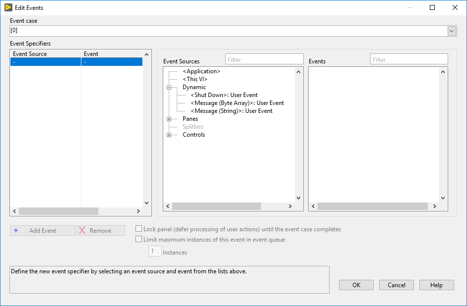
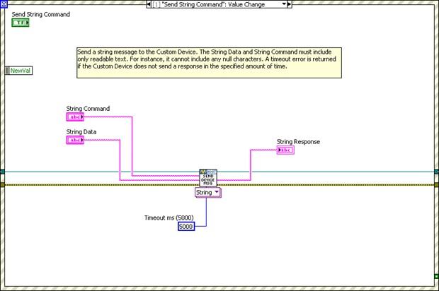
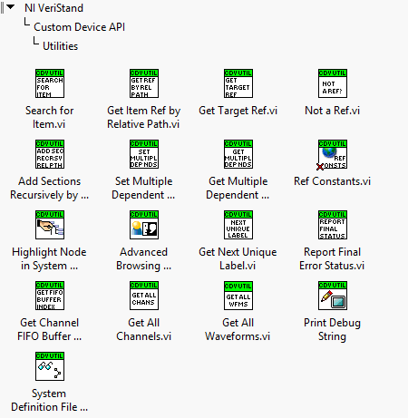
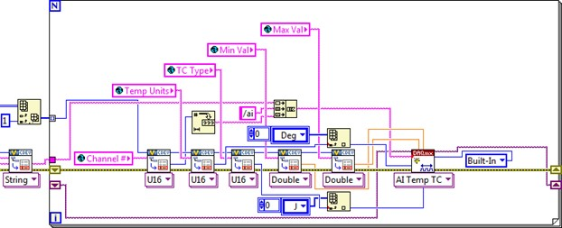
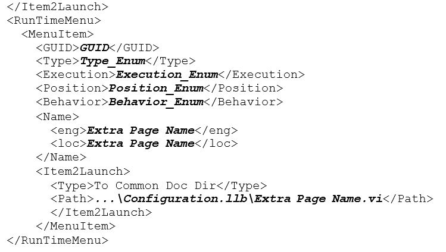

## Custom Device Tips and Tricks

This section contains tips and tricks for developing custom devices.

### Custom Device Engine Events

After a custom device has been deployed, data is exchanged via custom device channels. If channels are insufficient or overly cumbersome, you may implement your own communication mechanism. VeriStand also provides access to its own TCP pipe so you don’t have to maintain the connection. VeriStand’s pipe facilitates readable text and byte array data.

In the **NI VeriStand » Custom Device API » Driver Functions** LabVIEW palette you will find the NI VeriStand - Register Custom Device Engine Events VI. This VI provides three dynamic events that may be registered in any VI with a reference to the custom device.

1.	Shut Down
2.	Message (Byte Array)
3.	Message (String)

 
**Figure: Registering for NI VeriStand Dynamic Events**

The two message events fire when NI VeriStand – Send Custom Device Message VI is called.

 

**Figure: Sending a Message to NI VeriStand’s Dynamic Message Events**

There is an example of using the dynamic event pipe in &lt;LabVIEW&gt;\examples\NI VeriStand\Custom Devices\Communication Example\Communication Example Custom Device Project.lvproj.

### Block Writing and Reading

For inline hardware and inline model custom devices with a large number of channels, it’s more efficient to read and write channel data using block data references. Use the following VIs to work with block data references.

LabVIEW palettes: NI VeriStand » Custom Device API » Driver Functions » Data References:

•	Get Channel Block Data References 
•	Get Channel Values by Block Data Reference 
•	Set Channel Values by Block Data Reference 

Recall the Initialization code that generates a list of output channel references.
 

Instead of output channel references, obtain block references to the output channels. Modify the state data cluster accordingly.  
 

In the first version of the custom device, we auto-indexed each channel data reference.  
 

Modify the code to write the block reference instead. Notice the channel block data references are written en-mass outside the loop rather than channel-by-channel within the loop.  
 

### Working with String Constants

During custom device development, strings are used for property names and GUIDs. These strings are case-sensitive and, in the case of GUIDs, long and prone to typos. To facilitate working with these, consider using either **[LabVIEW Global Variables](https://zone.ni.com/reference/en-XX/help/371361R-01/lvconcepts/glob_variables/)** or a **[type definition Combo Box](https://zone.ni.com/reference/en-XX/help/371361R-01/lvhowto/creating_type_defs/)** control. When using the global variable, ensure that you have set the correct default value for the control. When using the Combo Box control, uncheck the **Values match Items** box on the Edit Items tab of the Properties dialog box.

The Combo Box control does not auto-update from its type definition. Completely populate the control before using it on the block diagram.

### Custom Error Codes

You can define custom error codes in LabVIEW and distribute the codes to VeriStand with a custom device. Copy the custom *errors.txt* file to VeriStand in the *&lt;Base&gt;\National Instruments\Shared\Errors\English* directory and add the file as a dependency in custom device and **[Custom Device XML file](https://www.ni.com/documentation/en/veristand/latest/manual/custom-device-xml/)**.

For RT targets, deploy the *errors.txt* file to the error directory on target to display error descriptions in Console Viewer.

For more information, refer to the Defining Custom Error Codes to Distribute throughout Your Application topic in the LabVIEW Help

### Utility VIs

The LabVIEW palette **NI VeriStand » Custom Device API » Utilities** contains useful utility VIs for custom device development. The VIs have Context Help documentation that better explain their functionality.

 
**Figure: Utility VIs palette**

### Sort Channels by FIFO Location

The **NI VeriStand » Custom Device API » Utilities » Get Channel FIFO Buffer Index** VI returns the FIFO buffer index for the input or output channel reference. Use this function for Asynchronous Custom Device channels to determine what index to read or write in the FIFO arrays. The VI also returns which FIFO Buffer (Input or Output) the channel will be located in. This function is only intended for Asynchronous Custom Devices.

Consider a custom device to read an arbitrary list of DAQmx thermocouple inputs. One way to accomplish the task would be to read all the hardware channels, cycle through the list of custom device channels looking for the channel property, and write the associated hardware channel value that corresponds to the custom device channel.

A better way to accomplish the task is to sort the channel references in the order they appear in the custom device FIFO, and configure the DAQmx task so the thermocouple channels are read in the same order as they appear in the FIFO.

 
**Figure: Sorting Asynchronous Custom Device Channels by their Order in the FIFO**

 
**Figure: Adding Channels to a DAQmx Task by their Order in the Custom Device FIFO**

There are several advantages of this architecture. The operator is free to add/remove/reorder channels how he pleases, only the desired channels are configured, and writing data to the custom device FIFO becomes naturally efficient.

 
**Figure: Writing Multiple Hardware Channels Directly to the Custom Device FIFO**

The hardware data returns from the DAQmx driver in the same order as the channel references in the asynchronous custom device FIFO.

### Triggering Within the Custom Device

There are many cases where you want to run code in the custom device when an event occurs. By comparing the *AEEnCh<1..8>* channel values to the previous iteration, we implemented simple value-triggering.

A useful VI for triggering is **[Signal Processing](https://zone.ni.com/reference/en-XX/help/371361R-01/lvanls/signal_processing_vis/)** » **[Point by Point](https://zone.ni.com/reference/en-XX/help/371361R-01/ptbypt/ptbypt_vi_help/)** » **[Other Functions](https://zone.ni.com/reference/en-XX/help/371361R-01/ptbypt/other_point_by_point_vis/)** » **[Boolean Crossing Point by Point](https://zone.ni.com/reference/en-XX/help/371361R-01/ptbypt/boolean_crossing_ptbypt/)**.

 
**Figure: Boolean Crossing PtByPt VI**

Recall the Write Data to HW state that reads NI VeriStand Channels. Add code to check the software trigger.
 

Check the SWTrig channel for a transition and handle the transition accordingly.
 

This triggering VI is most useful in asynchronous custom devices that do not execute in line with the PCL. An asynchronous device might iterate multiple times in a single iteration of the PCL, but this triggering VI will only assert on the desired edge of the transition.

### Adding Extra Pages After Creating the Custom Device Project

If your Custom Device requires additional pages for sections or channels, you should specify their names in the **Custom Device Extra Page Names** control of the [niveristand-custom-device-wizard](https://github.com/ni/niveristand-custom-device-wizard/releases) before you generate the LabVIEW project for the device. The tool ensures that the appropriate references are available to the page, the necessary declarations go into the Custom Device XML file, and the Build Specification deploys the page to the correct location.

There are two telltale signs that an extra page has not been added correctly to a custom device. The first is the default section or channel page loads into System Explorer instead of the expected extra page. The second is an error from System Explorer similar to *Custom Device Page Error: The following Custom Device page VI is not executable. The VI might not be found at the correct location, or it is missing dependencies that it requires to run. Please contact the Custom Device vendor for more information on this problem.*

In order to add a new page after the framework has been generated, you must manually perform all the actions the niveristand-custom-device-wizard performs.

Perform the following operations from the LabVIEW Project Explorer.
Incorrect changes to the Custom Device's XML file can corrupt the System Definition in VeriStand.

•	Ensure the device gets the appropriate device reference. The NI VeriStand API requires the correct Node Reference input. The VeriStand system is responsible for passing this reference to the page. There’s a VI Template in *Custom Device API.lvlib\Templates\Subpanel Page VI\Page Template.vit* for this purpose. Another way to ensure the new page gets the correct Node Reference is to copy a page generated by the niveristand-custom-device-wizard, such as the Main page.

•	Create the page section in the custom device XML file. The Custom Device's XML file tells the System Explorer how to load the device's files.
1.	Open the XML file from the Project Explorer window.
2.	Locate the &lt;Pages&gt; section.
3.	Copy the information between Main Page’s &lt;Page&gt; and &lt;/Page&gt; declarations.
4.	Paste the section immediately below the &lt;/Page&gt; declaration that closes the *Main Page* section.
5.	Change the &lt;eng&gt;, &lt;loc&gt;, and &lt;Path&gt; tags for the new page.
6.	Change the &lt;GUID&gt; to match the extra page’s GUID you created.
7.	Save and close the XML file.

•	Modify the configuration build specification. The niveristand-custom-device-wizard scripts two Build Specifications that put the custom device files in the necessary format and location for System Explorer.
1.	Open the *Configuration Release*’s build specification dialog box.
2.	In **Source Files**, expand the lvlib for your device.
3.	Make sure the new page is part of the **Always Included** section.
4.	In **Source Files Settings**, make sure the new page in the **Project Files** tree has the destination set to **Custom Device &lt;Name&gt; Folder**.
5.	Click **OK** to close the build specification.
6.	Save the LabVIEW project.

You must rebuild the **Configuration Release** and **Engine Release** build specifications to deploy the changes. You may then use the extra page as if it were generated by the niveristand-custom-device-wizard.

The **[niveristand-custom-device-wizard](https://github.com/ni/niveristand-custom-device-wizard)** is open source. If you have any questions about what the wizard does, you can refer to the code as you would any other VI.

### Custom Device XML

The [Custom Device XML Tags](https://www.ni.com/documentation/en/veristand/latest/manual/custom-device-xml-tags/) define settings for a custom device. These elements, and [non-standard element types](https://www.ni.com/documentation/en/veristand/latest/manual/custom-device-xml-element-types/), are defined in the *Custom Device.xsd* schema located in the *[&lt;Common Data&gt;](https://www.ni.com/documentation/en/veristand/latest/manual/veristand-directories-aliases/)\Custom Devices* directory. You can open the file in an XML or text editor to read the schema and view the hierarchy.

Consider the following example line from the *Custom Device.xsd* file:

<xs:element minOccurs="0" name="ActionVIOnDelete" type="Path" />

**A Line from the Custom Device XML Schema File**

The name of this tag is *ActionVIOnDelete*. Adding this tag to the custom device XML runs a VI when the operator deletes the item from System Explorer. You may find experimenting with the custom device XML easier in an empty custom device.

It may be helpful to explore VeriStand’s built-in components for examples on implementing XML features. The built-in components are found in &lt;Application Data&gt;\System Explorer\System Explorer Definition Files.

If a tag is opened, use the format *</tag_name>* to close the tag. If a tag must be specified but has no value, you may use the format *<tag_name />* to open and close the tag at the same time. This format has the same effect as *<tag_name>tag value</tag_name>*.

### Delete Protection

You can add &lt;DeleteProtection&gt;true&lt;/DeleteProtection&gt; to any section in the [custom device XML](https://www.ni.com/documentation/en/veristand/latest/manual/custom-device-xml-tags/) to disallow deleting the item from the configuration tree in System Explorer.

### Limiting Occurrences of the Custom Device

If it doesn’t make sense to have more than **N** instances of the custom device in a single System Definition, you can limit the number of instances by adding **&lt;MaxOccurrence&gt;N&lt;/MaxOccurrence&gt;** to the [custom device XML](https://www.ni.com/documentation/en/veristand/latest/manual/custom-device-xml-tags/) underneath the device type.

### Rename Protection

There may be cases when you depend on a custom device item to have a certain name, and you’d like to prevent the operator from renaming the item. Add **&lt;DisallowRenaming&gt;true&lt;/DisallowRenaming&gt;** below the &lt;/Name&gt; tag for any page to prevent the operator from renaming the item.

### Action VIs

VeriStand contains eight action VI templates that are triggered by different actions.

The following list displays the action VI templates provided by VeriStand in the **[Custom Device API library](https://www.ni.com/documentation/en/veristand/latest/manual/custom-device-api-library/)**.

**ActionVIOnLoad**  
Executes when VeriStand loads a custom device item into memory. This template helps create action VIs that launch background processes. For example, if your custom device requires large amounts of data, you can customize this template to start a daemon that runs processes or gathers data in the background.

**ActionVIOnDeleteRequest**  
Executes when a user tries to delete an item from the custom device. This template helps create action VIs that prevent a user from deleting a custom device item or warn a user of the implications of deleting a custom device item.

The template has the following unique parameters. 

•	Item Ref - The reference to the custom device item whose XML declaration calls this action VI. 
•	Refs that are about to get deleted - A 1D array of references to the items to be deleted. However, the 1D array will only contain one reference, as users can only delete one item at a time in the System Explorer window. 
•	Discard reason - An output you can use to capture the user's reason for deleting the item. 
•	Discard delete request? - Allows you to discard the delete request. After the action VI finishes executing, VeriStand will evaluate this output to determine whether or not to delete the item. If True, VeriStand will not delete the item. If False, VeriStand will delete the item. 
•	Additional items to delete - An array of references to additional items you want to delete. For example, if other custom device items depend on the item the user wants to delete, you can use this output to automatically delete those items. 

**ActionVIOnDelete**  
Executes after a user deletes an item from the custom device. You can customize this template to alert users which channel mappings break when they delete the custom device item. You can also customize this template to reconfigure hardware.

For example, if the user deletes a page that specifies custom configuration data for your hardware, you can customize the template to return the configuration to default settings.

**ActionVIOnSystemShutdown**  
Executes when System Explorer closes. You can customize this template to close hardware connections or to close daemons you launch from an ActionVIOnLoad action VI.

The template has the following unique parameters. 

•	Device Item Ref - Reference to the custom device item whose XML declaration calls this action VI. 
•	Unload SDF? - Indicates whether or not the system definition file was unloaded. Unload SDF? is always True. 
•	Saved? - Indicates whether or not a user saved the system definition file before closing System Explorer. 
•	Path - Path on disk to the system definition file. 
•	System Explorer Shutdown? - Indicates whether or not System Explorer closed. This parameter is always True. 

**ActionVIOnSave**  
Executes when a user saves the system definition file. For example, you can customize this template to log each time the custom device is saved.

**ActionVIOnDownload**  
Executes when a user deploys the system definition file containing the custom device to a real-time target. This action VI does not execute if a user deploys the system definition to a Windows target.

This template helps create action VIs that finalize the target configuration after you deploy the system definition. You can also customize this template to deploy any additional files or dependencies your custom device requires. For example, if your custom device reads and writes to shared variables, you can deploy those variables.

The template has the following unique parameters. 

•	Device Item Ref in - Reference to the custom device item whose XML declaration calls this action VI. 
•	ftp session - Open FTP session used to download the system definition to the target. You can use this open session to move additional files to the target. 
•	System Definition Dir - Path to the system definition file on disk. 
•	IP Address - IP address of the target. 
•	ftp session out - Open FTP session used to download the system definition file to the target. 

**ActionVIOnPaste**  
Executes when a user pastes a custom device item. This template helps create action VIs that check channel properties. For example, if the user pastes a page that configures a target, you can create an action VI to ensure that the new page does not attempt to reconfigure the target.

You can also customize this template to prompt a user to enter new values for the pasted item. For example, if a user pastes a page that will conflict with existing pages, you can prompt the user to enter new values for the page.

The template has the following unique parameters. 

•	Ptr in - Reference to the custom device item whose XML declaration calls this action VI. 
•	Parent - Reference to the parent of the custom device item whose XML declaration calls this action VI. 
•	All Ptrs - Array of references to the items the user pasted. You can only select one item to copy. This array only contains one reference that matches the Ptr in reference. 

**ActionVIOnCompile**  
Executes when VeriStand compiles the system definition file.

If you deploy the system definition, then undeploy it, and then redeploy it without making changes, this template does not execute because the system definition does not recompile.

You can customize this template to finish configuring your hardware. The system definition file compiles when a user deploys the system definition, so you can configure your hardware based on the final settings from the system definition.

You can also customize the template to quickly gather host-side settings. For example, often the custom device RT Engine VI uses properties set in the system definition. You can customize this template to read the values on the host side, which is much faster than reading them from the real-time target. You can then gather the properties into a single cluster, convert that cluster to a data variant, and write the variant as a single item property.

### Adding Toolbar buttons

A *Toolbar button* appears in the toolbar of **System Explorer**. These buttons only appear when displaying the configuration page associated with the button.

Within the **&lt;Page&gt;** tags for an item, you can use the **&lt;ButtonList&gt;** tag to configure the toolbar buttons that appear with the item's configuration page. Each **&lt;Button&gt;** must include a unique **&lt;ID&gt;** string that identifies the button. The toolbar button displays by default.

However, in each page VI, you can use the Disable Dynamic Button VI and the Enable Dynamic Button VI to dynamically disable and enable a button for that page based on its unique ID. These VIs are useful when you want the toolbar button to appear only when certain conditions are true.

These VIs are located in the labview\vi.lib\NI VeriStand\Custom Device API directory.

The following is an example framework you can use to implement a toolbar button.

 
**Custom Device Toolbar button framework**

### Adding shortcut menus

A *shortcut menu* for an item is the menu that appears when you right-click the item in System Explorer.

Within the **&lt;Page&gt;** tags for an item, you can use the **&lt;RunTimeMenu&gt;** tag to configure the shortcut menu for the item. Each **&lt;MenuItem&gt;** you add under **&lt;RunTimeMenu&gt;** includes an **&lt;Item2Launch&gt;** section that specifies a VI to run when an operator selects the menu item.

The Custom Device API library includes a template for this VI, RunTimeMenu Custom Item 2 Launch.vit, in the labview\vi.lib\NI VeriStand\Custom Device API directory.

The following is an example framework you can use to implement a shortcut menu.

 
**Custom Device XML shortcut menu declaration**