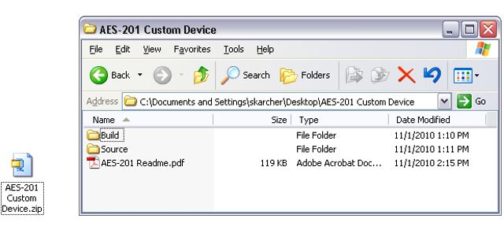

## Distributing the Custom Device

After you build, debug, validate, and benchmark the custom device, you’ll probably want to package it for operators and other developers to use. We’ll briefly cover a manual distribution process.

As with a generic application, you may streamline distribution by building:

- an Installer. See **[LabVIEW 2018 Help](https://zone.ni.com/reference/en-XX/help/371361R-01/)** » **[Fundamentals](https://zone.ni.com/reference/en-XX/help/371361R-01/TOC5.htm)** » **[Building and Distributing Applications](https://zone.ni.com/reference/en-XX/help/371361R-01/TOC24.htm)** » **[Creating Build Specifications](https://zone.ni.com/reference/en-XX/help/371361R-01/TOC26.htm)** » **[Creating Build Specifications](https://zone.ni.com/reference/en-XX/help/371361R-01/lvconcepts/creating_build_specs/)** » **[(Windows) Installer Properties](https://zone.ni.com/reference/en-XX/help/371361R-01/lvdialog/installer_tab_windows/)** for more information.

- a Package for Distribution. See **[LabVIEW 2018 Help](https://zone.ni.com/reference/en-XX/help/371361R-01/)** » **[Fundamentals](https://zone.ni.com/reference/en-XX/help/371361R-01/TOC5.htm)** » **[Building and Distributing Applications](https://zone.ni.com/reference/en-XX/help/371361R-01/TOC24.htm)** » **[Creating Build Specifications](https://zone.ni.com/reference/en-XX/help/371361R-01/TOC26.htm)** » **[Creating Packages for Distribution](https://zone.ni.com/reference/en-XX/help/371361R-01/lvhowto/creating_packages/)** for more information.

 
**Figure: AES-201 Distribution and Folder Hierarchy**

We recommend distributing the custom device by copying the necessary files into a simple folder hierarchy. The top-level folder should contain a Readme file and two folders: Build and Source. By copying the contents of the Build folder to VeriStand’s &lt;Common Data&gt;\Custom Devices\, the operator can add the custom device to his system definition.

The Source folder should contain the LabVIEW Project used to create the custom device and any supporting libraries and dependencies required to build the custom device. For example, you’ll want to ship the AES-201 custom device with the LabVIEW API and hardware dll.

Do not include the Custom Device API.lvlib files with the distribution. You do not want to replace the library on the operator’s machine, and you do not want to change the library linking on your machine.

The Readme file should contain instructions for installing, licensing, using, and modifying the custom device. It should also contain contact information if you plan to support the device, or a disclaimer if you don’t plan to support the device. The Readme file is a good place to put any benchmarking information you’ve obtained.
